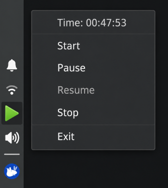
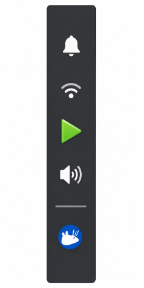
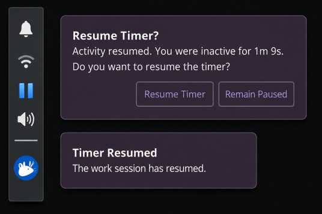

# WorkTimer

A lightweight, local-first desktop timer application for Linux (X11/Xubuntu) designed to help track work sessions, manage transitions (Start, Pause, Resume, Stop), and detect idle periods.

## Visuals

Here is how the application looks in action:

### System Tray


### Taskbar


### Idle Notification


---

## Programming Language & Prerequisites

WorkTimer is built using **Rust**. To run or build the application, you need to install the Rust compiler and toolchain, along with standard build utilities.

### 1. Install Rust
Install the stable Rust toolchain via `rustup` by running:
```bash
curl --proto '=https' --tlsv1.2 -sSf https://sh.rustup.rs | sh
```
Follow the on-screen instructions, then restart your terminal or run:
```bash
source "$HOME/.cargo/env"
```

### 2. Install System Dependencies
Since WorkTimer compiles DBus interfaces, you will need standard build tools, `cmake`, and compilation helpers to compile the vendored dependencies:
* **Ubuntu/Debian/Xubuntu**:
  ```bash
  sudo apt update
  sudo apt install build-essential cmake pkg-config
  ```

---

## How to Run the Project

You can run the application in two different modes using `cargo`.

### 1. Tray Mode (Default GUI Mode)
Runs the desktop tray application. It starts in the system tray, monitors mouse/keyboard activity, and sends notifications:
```bash
cargo run
```
To run the optimized release version:
```bash
cargo run --release
```

### 2. CLI Mode (Command Line Control)
You can interact with or query the running timer state directly from the command line:
* **Start the timer:**
  ```bash
  cargo run -- start
  ```
* **Pause the timer:**
  ```bash
  cargo run -- pause
  ```
* **Resume the timer:**
  ```bash
  cargo run -- resume
  ```
* **Stop the timer:**
  ```bash
  cargo run -- stop
  ```
* **Check the current status:**
  ```bash
  cargo run -- status
  ```

---

## How to Change the Default Inactive (Idle) Time

The default idle timeout is set to **5 minutes**, after which a notification is triggered. If not responded to in **30 seconds**, the timer is auto-paused.

These values can be changed by editing the configuration file:

1. **Locate the configuration file** at:
   `~/.config/worktimer/config.toml`  
   *(This file is automatically generated with default values when you first run the application.)*

2. **Edit the file** and update the parameters:
   ```toml
   idle_timeout_minutes = 5
   auto_pause_after_notification_seconds = 30
   ```
   * Change `idle_timeout_minutes` to your desired inactivity period (in minutes).
   * Change `auto_pause_after_notification_seconds` to customize how long the idle notification waits for a response before pausing the timer automatically.

3. **Restart the application** to apply the new settings.

---

## Application Data Locations

* **Database**: `~/.local/share/worktimer/worktimer.db` (stores session histories and timer event logs)
* **Logs**: `~/.local/state/worktimer/app.log`
* **Configuration**: `~/.config/worktimer/config.toml`
